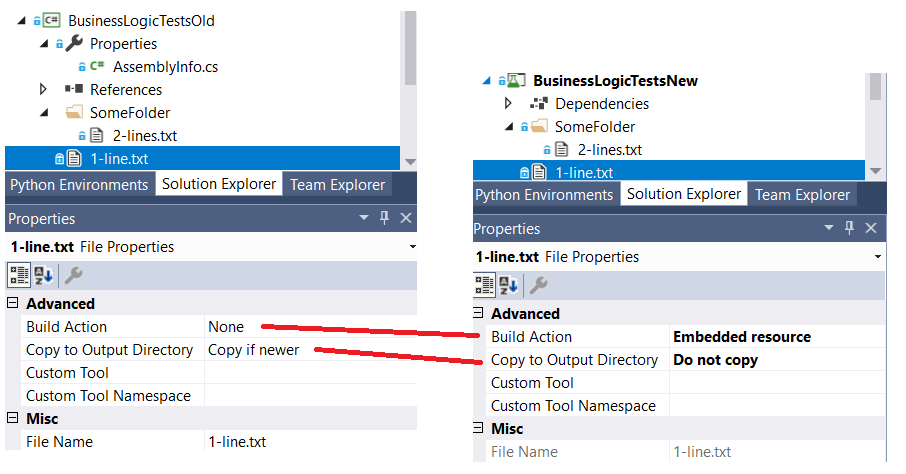

# xDeploymentItem

The initial idea was to port Visual Studio Unit Testing DeploymentItem attribute to xUnit.
But after some thinking I redesigned it while initial idea was not lost.

Here is a [good resource](https://xunit.net/docs/comparisons) to help you porting from Visual Studio Unit Testing Framework (a horrible framework, even Microsoft doesn't use it anymore) to xUnit, but **DeploymentItem** is a missing part in that comparison. **xDeploymentItem** just tries to fill that gap (nothing more!).

# Porting Visual Studio Unit Testing DeploymentItem
## 1. Change "Copy to output directory" to embedded resources

## 2. Change tests
From:
```csharp
[TestMethod]
[DeploymentItem("MyFile.txt")]
public void MyMethodWorksOnMyFile()
{
	string fullPathToMyFile = Path.Combine(TestContext.DeploymentDirectory, "MyFile.txt");
	Assert.IsTrue(MyClass.MyMethod(fullPathToMyFile));
}
```
To:
```csharp
[Fact]
public void MyMethodWorksOnMyFile()
{
	using (var deployer = new XDeploymentHelper(this))
	{
		string fullPathToMyFile = deployer.DeployEmbeddedResource("MyFile.txt");
		Assert.True(MyClass.MyMethod(fullPathToMyFile));
	}
}
```

Take a look at side-by-side tests for [Visual Studio Unit Testing DeploymentItem](./src/BusinessLogicTestsOld/FileOperationsTests.cs)
and [xDeploymentItem](./src/BusinessLogicTestsNew/FileOperationsTests_VSUT.cs)


## 3. That's all...
It should work, otherwise fill the issue if it doesn't.
All the **xDeploymentItem** logic is [one small file](./src/xDeploymentItem/XDeploymentHelper.cs), copy it to your code base, read and debug it.

Minimum .NET Standard version: 1.3.

# Links

You can find that Visual Studio DeploymentItem documentation
[here](https://docs.microsoft.com/en-us/dotnet/api/microsoft.visualstudio.testtools.unittesting.deploymentitemattribute?view=mstest-net-1.2.0).

Comparing xUnit.net to other frameworks is [here](https://xunit.net/docs/comparisons)
